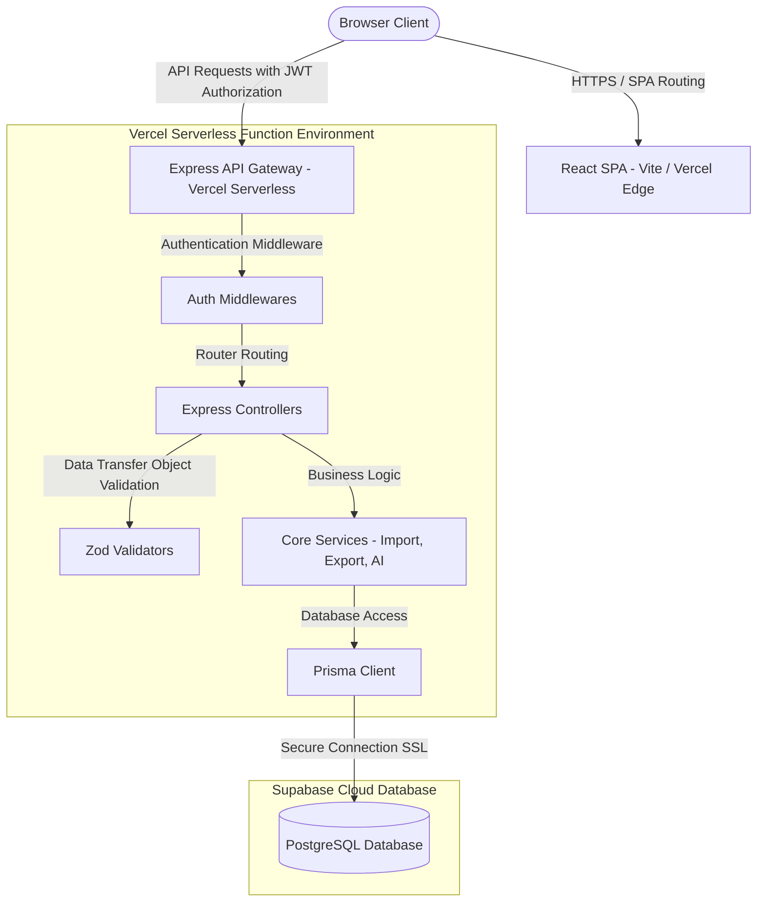
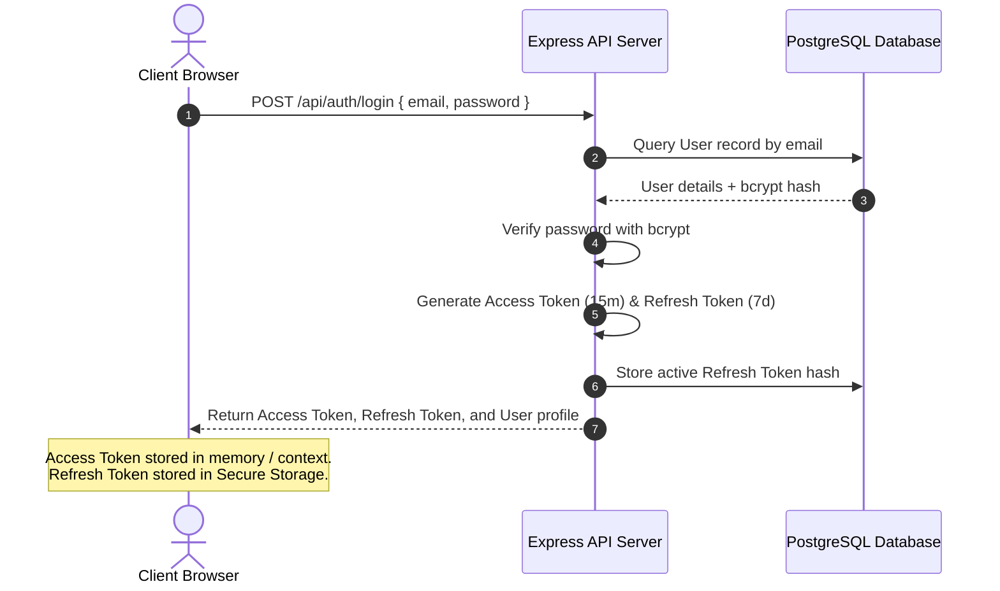

# 🏛️ Zx-Escola System Architecture

This document describes the high-level software architecture, data flow, and authentication mechanisms of the **Zx-Escola** School Management SaaS.

---

## 🧭 1. Overview & Objectives

Zx-Escola is a multi-tenant/multi-role School Management System designed to handle academic, financial, administrative, and library modules in one cohesive platform.

### Objectives
- **Scalability**: Decoupled Client-Server architecture allowing independent scale of the frontend (Vite static CDN) and backend (Express serverless functions).
- **Security**: Strict Role-Based Access Control (RBAC) protecting sensitive academic and financial records.
- **Maintainability**: Unified TypeScript type safety shared across both modules, coupled with Prisma ORM for structured database operations.

---

## 🛠️ 2. Technology Stack

### Frontend Client
- **Core**: React 18 + TypeScript 5 + Vite 5
- **Routing**: React Router DOM v6 (Client-side routing with fallback configs)
- **Styling**: Tailwind CSS v3
- **Data Fetching**: Axios client with interceptors for JWT bearer token injection

### Backend Serverless API
- **Runtime**: Node.js v20+ / Express.js
- **ORM**: Prisma ORM v5 (configured for PostgreSQL/Supabase)
- **Validation**: Zod schema validations for client payloads
- **Security**: Helmet, CORS policies, Rate Limiter (express-rate-limit)
- **Authentication**: JWT (JSON Web Tokens) with a dual-token mechanism (Access Token + Refresh Token)

---

## 🎨 3. System Architecture Diagram

---

## 🔑 4. Authentication Flow

Zx-Escola implements a stateless JWT authentication system:

### Refresh Token Loop
- When the Access Token expires (returns `401 Unauthorized`), the client interceptor queries `POST /api/auth/refresh` sending the Refresh Token.
- If the token is valid, unrevoked, and matches the database hash, the server generates a new Access Token and returns it.

---

## 🔄 5. Core Data Flows

### Importer Engine Data Flow (CSV/Excel/XML to Postgres)
1. **Upload**: Client sends a spreadsheet file to `POST /api/imports/upload` containing students or teacher details.
2. **Parser Selection**: `UploadController` reads file extension and uses the `ParserFactory` to load the correct parser (CsvParser, ExcelParser, XmlParser, etc.).
3. **Transaction Processing**: The parsed rows are mapped onto database columns through the `ImportEngine` using an in-memory mapped layout. Each row is written in an individual transaction to allow partial success records.
4. **Log Registry**: Detailed execution stats (`ImportLog` and `ImportHistory`) are recorded for each line of input to help administrative tracking.
